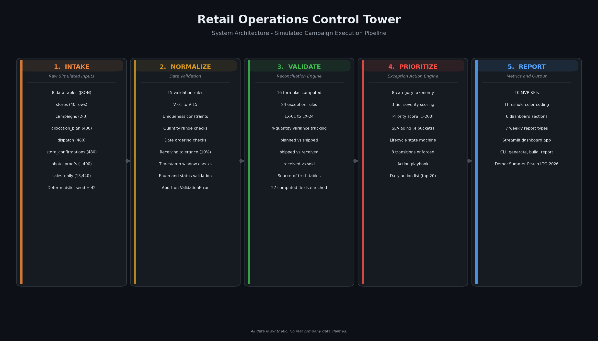

# Retail Operations Control Tower

A Python control tower for multi-store retail campaign execution. It simulates a
coffee chain running a seasonal limited-time-offer campaign, validates the data,
detects exceptions, ranks them by priority, and renders a Streamlit dashboard
plus a weekly operations report so the ops team knows what to fix first.

> **Simulated data.** All data is synthetic. No real company data, internal
> knowledge, or real-world retail operations experience is claimed.

---

## Architecture



The control tower processes simulated retail campaign data through five stages:
**intake > normalize > validate > prioritize > report**. Raw inputs flow through
validation and reconciliation into source-of-truth tables, the exception action
engine ranks issues by priority, and the metrics layer renders the dashboard and
weekly report.

An interactive HTML version is at `docs/architecture.html`. Regenerate both
outputs with `python scripts/render_architecture_diagram.py`.

---

## Why this project exists

Multi-store retail chains run seasonal campaigns that require coordinated
execution across HQ planning, distribution centers, field reps, and store staff.
The operational reality is that execution gaps are the default, not the
exception. This project models the five failure modes that eat campaign margin:

1. **Late campaign activation** - promotions go live days late because there is
   no task verification or escalation when a store has not executed.
2. **Quantity mismatches** - planned vs. shipped vs. received vs. sold
   quantities diverge at every handoff and nobody reconciles them until the
   campaign window has closed.
3. **Pencil-whipping** - store teams check off tasks that were never done
   because checklists have no proof layer.
4. **Stockout and overstock risk** - weeks-of-cover is not evaluated against
   supplier lead time, so stockouts happen mid-campaign and overstock lands at
   clearance.
5. **No prioritized action queue** - exceptions exist but are not ranked by
   urgency, impact, or campaign window, so the ops team does not know what to
   fix first.

The control tower turns raw operational data into a prioritized, actionable
work queue - not just a status report.

---

## Workflow modeled

The project models the four-quantity allocation lifecycle that real retail ops
teams track across every campaign:

```
HQ plan --> DC dispatch --> Store receiving --> Store selling
 (planned)    (shipped)       (received)        (sold)
```

At each handoff, quantities can diverge. The reconciliation engine computes
variances, the exception engine classifies gaps into a 9-category taxonomy, and
the action list ranks them by priority score so the team works the highest-impact
items first. The full workflow:

1. **Generate** - a deterministic simulation creates 8 interlocking data tables
   for a synthetic coffee chain (stores, campaigns, allocations, dispatch,
   confirmations, photo proofs, daily sales, issues).
2. **Validate** - 9 data-quality rules check required columns, duplicate keys,
   foreign keys, and planned-vs-actual variances across all tables.
3. **Reconcile** - the exception engine scans every allocation line and detects
   9 exception types: missing confirmation, late confirmation, quantity
   mismatch, missing photo proof, late photo proof, stockout risk, overstock
   risk, low sell-through, and unresolved SLA breach.
4. **Prioritize** - each exception gets a severity tier (critical / watch /
   info), a priority score, an SLA deadline, and a recommended action. The
   daily action list ranks the top items.
5. **Report** - 12 KPIs, an area-manager scorecard, and an 8-section weekly
   operations report are generated. The Streamlit dashboard renders all of it
   interactively.
6. **Diagnose** - the insight engine mines the exception table for ranked
   root-cause findings through a four-layer analytical framework: concentration
   (Pareto, Gini), segmentation (ANOVA, Kruskal-Wallis, Mann-Whitney post-hoc),
   attribution (binomial exact tests, permutation test, chi-square), and
   opportunity (rebalancing, SLA profiling, financial modeling, sensitivity).

---

## Insight engine

The diagnostic engine (`scripts/insight_engine/`) runs a multi-layer
statistical analysis over the exception dataset. It produces ranked,
quantified findings rather than descriptive summaries. Charts are saved as
PNGs to `images/`, structured data exports to `data/insight_exports/`, and
the analytical narrative to `docs/insight_engine_story.md`.

### Analytical layers

| Layer | Question | Methods |
|-------|----------|---------|
| Concentration | Where is risk focused? | Pareto, Gini coefficient with bootstrap 95% CI (n=10,000, seed=42) |
| Segmentation | What drives exceptions? | ANOVA + Kruskal-Wallis, Shapiro-Wilk + Levene assumption checks, Mann-Whitney U post-hoc with Holm correction, rank-biserial + Cohen's d, epsilon-squared |
| Attribution | Who is responsible? | Exact binomial tests over 32-cell family with BH-FDR, store-level permutation test (20,000 iterations) for field reps, chi-square GoF with Cramer's V |
| Opportunity | What to fix? | Rebalancing census, SLA breach profiling with Wilson CI, aging bucket analysis, illustrative financial model, sensitivity testing (Spearman rho) |

### Statistical rigor

Every test includes assumption checks before execution, effect sizes alongside
p-values, multiple comparison correction where families overlap, and
transparent reporting of non-significant results:

- **Assumption checks**: Shapiro-Wilk normality + Levene homogeneity before each
  ANOVA, with explicit fallback to Kruskal-Wallis when assumptions fail
- **Post-hoc tests**: Mann-Whitney U pairwise comparisons with Holm correction,
  rank-biserial effect sizes, plus Cohen's d as parametric reference
- **Multiple comparison correction**: Benjamini-Hochberg FDR on the 32-cell
  hotspot family and 16-rep field-rep family
- **Confidence intervals**: Bootstrap percentile CI on Gini (10,000 resamples),
  bootstrap CI on field-rep lift (5,000 resamples), Wilson CI on proportions
- **Effect sizes**: epsilon-squared for Kruskal-Wallis, eta-squared for ANOVA,
  Cramer's V for chi-square, rank-biserial for Mann-Whitney, Cohen's d for
  pairwise comparisons
- **Permutation testing**: Store-level permutation test (20,000 iterations) for
  field-rep attribution, respecting store-level clustering instead of assuming
  independent exceptions
- **Sensitivity analysis**: Impact score rankings tested across 3 weight
  scenarios with Spearman rho, plus verified reconstruction of all 14 published
  scores from raw data

---

## Features

- **Deterministic data simulation** - 100 stores, 3 campaigns, 1,410 allocation
  lines, 39K daily sales rows, all reproducible from a single seed.
- **9-rule validation engine** - checks required columns, primary key
  uniqueness, foreign key integrity, and planned-vs-actual variances.
- **9-category exception detection** - scans confirmations, photo proofs, and
  sales patterns to surface operational gaps automatically.
- **Priority scoring and SLA** - 3-tier severity model, 4 aging buckets
  (fresh / aging / overdue / chronic), and SLA status tracking (within /
  approaching / breached / paused).
- **12 KPI metrics layer** - 5 process KPIs (readiness, confirmation, photo
  proof, allocation accuracy, mismatch rate) and 7 performance KPIs (exception
  rate, open count, SLA breach count, sell-through, stockout risk, overstock
  risk, AM backlog).
- **Area manager scorecard** - per-AM breakdown of stores, allocations, open
  exceptions, critical count, SLA breaches, and sell-through.
- **8-section weekly report** - executive snapshot, campaign readiness,
  allocation reconciliation, exception backlog, AM follow-up, sell-through notes,
  recommended actions, and data caveats.
- **Statistical insight engine** - 4-layer analytical framework (concentration,
  segmentation, attribution, opportunity) with modular scripts, chart output,
  and structured data exports: assumption checks, effect sizes, FDR correction,
  permutation testing, confidence intervals, and sensitivity analysis.
- **Interactive Streamlit dashboard** - filterable by campaign, region, and
  area manager; renders KPI tiles, reconciliation tables, exception backlog,
  ranked insight cards with a Pareto concentration chart, and the full weekly
  report inline.
- **354 passing tests** - full unit and integration coverage of models,
  validation, exception engine, metrics, insights, reporting, I/O, CLI, and
  constants.

---

## Data model

8 tables, all stored as CSV in `data/sample/`:

| Table | Rows (demo) | Purpose |
|-------|-------------|---------|
| stores | 100 | Store master: region, format, area manager, field rep |
| campaigns | 3 | Campaign master: dates, SKUs, hero SKU, POSM, targets |
| allocation_plan | 1,410 | Per-store per-SKU planned quantities |
| dispatch | 1,410 | Shipment records: shipped qty, DC, carrier |
| store_confirmations | 1,366 | Receiving + visit records, audit results, compliance |
| photo_proofs | 3,091 | Photo metadata: GPS, timestamp, validation status |
| sales_daily | 39,480 | Daily sales: units sold, on-hand, transfers, shrink |
| issues | 123 | Pre-seeded exception and corrective action records |

The full schema (every column, type, example, and purpose) is in
`docs/data-dictionary.md`.

---

## KPI and exception logic

### KPIs (12)

**Process KPIs (execution quality):**

| KPI | What it measures |
|-----|-----------------|
| Campaign readiness rate | Allocations with on-time confirmation + photo proof in launch window |
| Confirmation completion rate | Dispatches with a matching store confirmation |
| Photo proof completion rate | Confirmations with at least one photo proof |
| Allocation accuracy rate | Confirmations where received exactly matches shipped |
| Quantity mismatch rate | Confirmations with a received-vs-shipped variance |

**Performance KPIs (risk and workload):**

| KPI | What it measures |
|-----|-----------------|
| Exception rate | Total exceptions per allocation |
| Open exception count | Active exceptions (open, in_progress, raised, escalated) |
| SLA breach count | Exceptions past their SLA deadline |
| Sell-through rate | Units sold / units received |
| Stockout risk count | Stores with on-hand depleted to zero after prior sales |
| Overstock risk count | Stores with sell-through below 30% and inventory remaining |
| AM follow-up backlog | Active exceptions assigned to area managers |

### Exception types (9)

| Type | Default owner | SLA |
|------|--------------|-----|
| missing_confirmation | Field Operations | 48h |
| late_confirmation | Store Manager | 48h |
| quantity_mismatch | DC Operations | 48h |
| missing_photo_proof | Field Representative | 48h |
| late_photo_proof | Field Representative | 48h |
| stockout_risk | Replenishment Planner | 24h |
| overstock_risk | Merchant | 7 days |
| low_sell_through | Merchant + Planner | 7 days |
| unresolved_issue_sla_breach | Operations Lead | 24h |

### Priority score

```
priority_score = (severity_weight x 100) + age_pressure + business_impact + campaign_urgency
```

- severity_weight: critical=3, watch=2, info=1
- age_pressure: (days_open / sla_days) x 50, capped at 50
- business_impact: hero SKU or flagship store=30, standard=15, low-velocity=5
- campaign_urgency: 20 if in launch window, 10 if active outside, 0 if none

### SLA aging buckets

| Bucket | Age | Meaning |
|--------|-----|---------|
| 0 | 0-5 days | Fresh: within normal SLA window |
| 1 | 6-15 days | Aging: approaching SLA limit |
| 2 | 16-30 days | Overdue: SLA breached, escalation active |
| 3 | 30+ days | Chronic: needs root-cause intervention |

---

## Quick start from source

This project is installed from source. It is not on PyPI.

### Prerequisites

- Python 3.11 or later
- [uv](https://docs.astral.sh/uv/) (recommended) or standard pip

### Install

```bash
git clone https://github.com/ramdhanhdy/retail-ops-control-tower.git
cd retail-ops-control-tower

# Create a virtual environment (uv recommended)
uv venv
source .venv/bin/activate

# Install in development mode with dev dependencies
uv pip install -e ".[dev]"
```

Or with standard pip:

```bash
python -m venv .venv
source .venv/bin/activate
pip install -e ".[dev]"
```

### Generate data and run the pipeline

The project ships with standalone scripts that produce the full dataset and all
outputs. Run them in order:

```bash
# 1. Generate 8 CSV data tables (deterministic, seed=42)
python scripts/generate_sample_data.py

# 2. Detect exceptions and build the daily action list
python scripts/build_exception_table.py --aging-date 2026-07-15

# 3. Compute KPIs and area manager scorecard
python scripts/build_kpi_summary.py --aging-date 2026-07-15

# 4. Generate the weekly operations report and executive summary
python scripts/generate_weekly_report.py --aging-date 2026-07-15

# 5. Generate the validation summary
python scripts/generate_validation_summary.py

# 6. Build ranked diagnostic insights
python scripts/build_insights.py --aging-date 2026-07-15
```

### Run the insight engine

```bash
# Requires: pandas, scipy, statsmodels, matplotlib
python -m scripts.insight_engine.run_all
```

This produces all chart PNGs in `images/`, structured data exports in
`data/insight_exports/`, and the analytical narrative in
`docs/insight_engine_story.md`. Each layer can also be run individually:

```bash
python -m scripts.insight_engine.layer1_concentration
python -m scripts.insight_engine.layer2_segmentation
python -m scripts.insight_engine.layer3_attribution
python -m scripts.insight_engine.layer4_opportunity
```

### Run the Streamlit dashboard

```bash
streamlit run dashboard/app.py
```

Then open http://localhost:8501 in your browser.

### Run the test suite

```bash
pytest -q
```

### Run the full pipeline smoke test

```bash
bash scripts/smoke.sh
```

This regenerates all data and outputs from scratch and runs the test suite.

### Package CLI

The package also exposes three CLI commands (defined in `pyproject.toml`):

```bash
retail-ops-generate-data --stores 40 --skus 12 --days 28 --seed 42
retail-ops-build-exceptions --input-dir output --output-dir output
retail-ops-report --input-dir output --output-dir output/reports --format text
```

Or via the unified entry point:

```bash
python -m retail_ops_control_tower --help
```

---

## Example outputs

After running the pipeline, these files are generated:

**Processed data (`data/processed/`):**

| File | Description |
|------|-------------|
| `exceptions.csv` | All detected exceptions with severity, priority, SLA status |
| `daily_action_list.csv` | Ranked action list for daily operations |
| `kpi_summary.csv` | 12 dashboard-ready KPIs |
| `am_scorecard.csv` | Per-area-manager scorecard |
| `insights.csv` | Ranked diagnostic findings with lift and impact scores |

**Reports (`reports/`):**

| File | Description |
|------|-------------|
| `weekly_ops_report.md` | 8-section weekly operations brief |
| `executive_summary.md` | Short executive summary with top action items |
| `validation_summary.md` | Data quality findings from the validation engine |
| `insights.md` | Diagnostic brief: root-cause findings and focus areas |

**Insight engine outputs:**

| Output | Location | Description |
|-------|----------|-------------|
| Chart PNGs | `images/` | 11 charts: Pareto/Lorenz, boxplots, hotspot lift, field-rep lift, mismatch, aging, financial, rebalancing, SLA, sensitivity |
| Data exports | `data/insight_exports/` | 13 JSON/CSV files with full statistical results per layer |
| Analytical narrative | `docs/insight_engine_story.md` | 547-line markdown story with embedded charts (Indonesian) |

**Sample diagnostic findings (from the default 100-store, 3-campaign dataset):**

```
INS-001  47 of 100 stores (47%) produce 80.3% of all exceptions
         Gini = 0.459, bootstrap 95% CI [0.400, 0.513]

INS-002  Store format predicts exception volume
         Kruskal-Wallis H=29.36, p=1.9e-06, epsilon-squared=0.275 (large)
         4/6 format pairs significant after Holm correction

INS-003  No field rep is statistically significant after permutation test
         Nora Smith: lift=1.93x, p-FDR=0.19 (not significant)
         Store-level permutation, 20,000 iterations + BH-FDR

INS-004  15 SKUs across 3 campaigns have rebalancing transfer candidates
         64 store-campaign touchpoints, illustrative ROI 12.4x

INS-005  SLA breach rate = 10.0% (160/1,603)
         Wilson 95% CI [8.6%, 11.5%]
```

---

## Portfolio relevance

This project demonstrates end-to-end data workflow engineering for an
operations-adjacent role. It is positioned as a tech-forward data and workflow
analyst portfolio piece, not an operations specialist claim.

**What it shows:**

- Building a deterministic data simulation that produces realistic, interlocking
  operational data across 8 tables.
- Implementing a validation and reconciliation engine that enforces data
  integrity and computes planned-vs-actual variances.
- Designing an exception management system with severity scoring, SLA tracking,
  and a priority-ranked action list.
- Computing a KPI metrics layer with threshold color-coding and an area-manager
  scorecard.
- Building a diagnostic insight layer that moves beyond "what is broken" to
  "why, where it concentrates, and what it costs" using a four-layer
  statistical framework with full rigor: assumption checks, effect sizes,
  FDR correction, confidence intervals, and power analysis.
- Rendering an interactive Streamlit dashboard and a structured weekly report.
- Writing 354 passing tests that cover models, validation, exceptions, metrics,
  insights, reporting, I/O, and CLI.

**What it does not claim:**

- Real-world retail operations experience.
- Access to any real company's data or internal systems.
- A production-ready system. This is a portfolio project with simulated data.

---

## Limitations and non-goals

- **Simulated data only.** All data is synthetic and deterministic.
- **No deep learning.** Rule-based logic and statistical tests. No neural
  networks, no ML model training, no time-series forecasting.
- **No ERP clone.** Models the retail ops control-tower workflow only.
- **No authentication.** Single-user application.
- **No real photos.** Photo proof records contain metadata only.
- **No real-time streaming.** Data is generated in batches.
- **No cloud deployment.** Runs locally.
- **Not published to PyPI.** Install from source only.

Deferred to a future version:

- WSSI (Weekly Sales, Stock and Intake) trading view.
- Transfer and markdown optimization engine.
- Per-role action list filtering (7 roles).
- Sub-component compliance tiles (planogram, POSM, pricing).

---

## Documentation

| Document | Description |
|----------|-------------|
| `docs/prd.md` | Product requirements document |
| `docs/data-dictionary.md` | Data dictionary (8 tables, all columns) |
| `docs/implementation-plan.md` | Engineering blueprint and phase plan |
| `docs/scope-guard.md` | Scope guard (in-scope and non-goals) |
| `docs/architecture.png` | Architecture diagram (PNG) |
| `docs/architecture.html` | Architecture diagram (interactive HTML) |
| `docs/research/` | Research documents (campaign execution, allocation, KPIs, exceptions) |

---

## Project structure

```
retail-ops-control-tower/
|-- pyproject.toml                         # Package metadata, dependencies, CLI scripts
|-- README.md                              # This file
|-- LICENSE                                # MIT
|
|-- retail_ops_control_tower/              # Main package
|   |-- cli.py                             # CLI argument parsing and dispatch
|   |-- config.py                          # Configuration dataclass and thresholds
|   |-- constants.py                       # Enums: exception types, severity, states, aging
|   |-- validation.py                      # 9-rule validation engine
|   |-- metrics.py                         # 12 KPI metrics layer
|   |-- reporting.py                       # Weekly report generator
|   |-- insights.py                        # Diagnostic insight engine
|   |-- data_generation.py                 # Deterministic sample data generator
|   |-- models/                            # Dataclass models for 8 tables
|   |-- exceptions/                        # Exception engine, action list, SLA
|   |-- io/                                # CSV/JSON I/O and serializers
|   |-- reconciliation/                    # Reconciliation engine (formulas, rules, taxonomy)
|   |-- dashboard/                         # Dashboard sections and KPI rendering
|   |-- reports/                           # Report generator and templates
|   |-- demo/                              # Demo story runner
|
|-- scripts/
|   |-- generate_sample_data.py            # Generate 8 CSV tables
|   |-- build_exception_table.py           # Build exceptions and action list
|   |-- build_kpi_summary.py               # Build KPIs and AM scorecard
|   |-- generate_weekly_report.py          # Generate weekly report
|   |-- generate_validation_summary.py     # Generate validation summary
|   |-- build_insights.py                  # Build ranked diagnostic insights
|   |-- render_architecture_diagram.py     # Render architecture PNG + HTML
|   |-- insight_engine/                    # Modular statistical analysis engine
|       |-- __init__.py                    # Exposes run_all()
|       |-- common.py                      # Shared data loading and utilities
|       |-- charts.py                      # Chart styling helpers
|       |-- layer1_concentration.py        # Pareto + Gini (bootstrap CI)
|       |-- layer2_segmentation.py         # ANOVA + Kruskal-Wallis + Mann-Whitney post-hoc
|       |-- layer3_attribution.py         # Binomial hotspots + permutation field-rep test
|       |-- layer4_opportunity.py          # Rebalancing, SLA, financial, sensitivity
|       |-- run_all.py                     # Main entry point
|
|-- images/                                # Generated chart PNGs (11 files)
|-- data/sample/                           # 8 generated CSV tables
|-- data/processed/                        # Processed outputs (exceptions, KPIs, action list)
|-- data/insight_exports/                  # Statistical analysis exports (JSON + CSV)
|-- reports/                               # Generated reports
|-- docs/                                  # Documentation, architecture, analytical narrative
|-- tests/                                 # 354 passing tests
```

---

## License

MIT
