# Insight Engine — Narasi Analitik Menara Kendali Operasi Ritel

**Retail Ops Control Tower | Tanggal snapshot (aging date): 2026-07-15**

> Seluruh data bersifat simulasi. Semua angka dalam dokumen ini dihasilkan
> langsung oleh skrip `scripts/insight_engine/` terhadap data aktual di
> `data/processed/` dan `data/sample/` — tidak ada angka yang dikarang.
> Jalankan `python -m scripts.insight_engine.run_all` untuk mereproduksi
> semua grafik dan ekspor data.

---

## Cara membaca dokumen ini

Narasi ini mengikuti **Prinsip Piramida**: gagasan utama dinyatakan lebih
dulu, lalu didukung bukti yang semakin dalam. Setiap bagian mengikuti
struktur yang sama:

> **Observasi** → **Bukti Statistik** → **Interpretasi Bisnis** → **Rekomendasi Tindakan**

### Gagasan utama

> *Risiko operasional armada ini terkonsentrasi secara struktural, bukan
> tersebar merata. Koefisien Gini 0,459 (CI 95% bootstrap [0,400; 0,513])
> menunjukkan 47 dari 100 toko (47%) menghasilkan 80,3% dari 1.603 eksepsi.
> Pendorong utamanya adalah **format toko** (Kruskal–Wallis H=29,36,
> p=1,9×10⁻⁶, ε²=0,275): format drive-thru dan kiosk secara struktural jauh
> lebih rawan eksepsi daripada standard dan flagship. Perbedaan total volume
> antar wilayah TIDAK signifikan, tetapi sel wilayah×tipe tertentu nyata:
> wilayah North kelebihan indeks pada overstock (1,52×) dan low sell-through
> (1,33×) setelah koreksi BH-FDR. Tidak ada satu pun field rep yang dapat
> ditandai secara andal setelah uji yang memperhitungkan klasterisasi tingkat
> toko, dan quantity mismatch tersebar merata di semua DC dan kurir —
> masalahnya sistemik, bukan kesalahan mitra tertentu. Intervensi paling
> efektif karenanya bersifat tertarget: watchlist 47 toko, kebijakan khusus
> format, audit assortment wilayah North, dan transfer antar-toko untuk 15
> SKU (ROI ilustratif 12,4×).*

### Kerangka analitik

| Lapisan | Pertanyaan | Metode |
|---------|------------|--------|
| **1. Konsentrasi** | Seberapa timpang sebaran eksepsi? | Analisis Pareto, koefisien Gini + CI bootstrap |
| **2. Segmentasi** | Atribut toko apa yang memprediksi eksepsi? | ANOVA + Kruskal–Wallis (dengan uji asumsi), post-hoc Mann–Whitney (Holm), ε², rank-biserial, Cohen's d |
| **3. Atribusi** | Dari mana mode kegagalan spesifik berasal? | Uji binomial eksak + BH-FDR, uji permutasi tingkat toko, chi-square GoF + Cramér's V |
| **4. Peluang** | Tindakan apa yang membuka nilai terbesar? | Analisis gap rebalancing, profil SLA/umur (CI Wilson), model finansial ilustratif, uji sensitivitas (Spearman ρ) |

### Cakupan data

100 toko aktif · 1.603 eksepsi (9 tipe) · 651 kritis (40,6%, CI Wilson
[38,2%; 43,0%]) · 160 pelanggaran SLA (10,0%, CI Wilson [8,6%; 11,5%]) ·
8 mendekati batas SLA · 3 kampanye aktif (C-2026-PEACH, C-2026-BTS,
C-2026-FCL).

---

## Ringkasan Eksekutif

1. **Risiko terkonsentrasi:** 47 dari 100 toko (47%) menyumbang 80,3%
   eksepsi (Gini 0,459). Program tertarget pada kurang dari separuh armada
   menangani mayoritas risiko.
2. **Format adalah pendorongnya:** drive-thru (rata-rata 30,4 eksepsi/toko)
   dan kiosk (29,6) jauh di atas standard (12,0) dan flagship (6,2) — efek
   besar dan signifikan setelah koreksi perbandingan berganda.
3. **Geografi hanya penting per-tipe:** total volume antar wilayah setara
   (p=0,675), tetapi North kelebihan indeks signifikan pada overstock
   (1,52×) dan low sell-through (1,33×) — sinyal masalah perencanaan
   assortment lokal, bukan eksekusi lapangan.
4. **Tidak ada field rep yang bisa disalahkan berdasarkan data ini:** setelah
   uji permutasi yang menghormati klasterisasi toko + koreksi BH-FDR, tidak
   ada rep yang signifikan (lift tertinggi: Nora Smith 1,93×, p-FDR=0,19).
5. **Quantity mismatch bersifat sistemik:** sebarannya tak terbedakan dari
   merata di 3 DC (p=0,782) dan 3 kurir (p=0,817) — perbaikannya di lapisan
   rekonsiliasi data, bukan manajemen vendor.
6. **Kemenangan tanpa biaya pengadaan:** 15 SKU mengalami stockout dan
   overstock secara simultan dalam kampanye yang sama — kandidat transfer
   antar-toko dengan ROI ilustratif 12,4×.

---

## Lapisan 1 — Analisis Konsentrasi

### Observasi

Eksepsi tidak tersebar merata. Rata-rata 16,0 eksepsi per toko, tetapi
median hanya 13 dan maksimum 55 — distribusi miring ke kanan. **16 dari 100
toko tidak memiliki eksepsi sama sekali**, dan toko-toko ini wajib
diikutsertakan dalam statistik armada (mengabaikannya membuat ketimpangan
tampak lebih kecil dari kenyataan).

### Bukti statistik

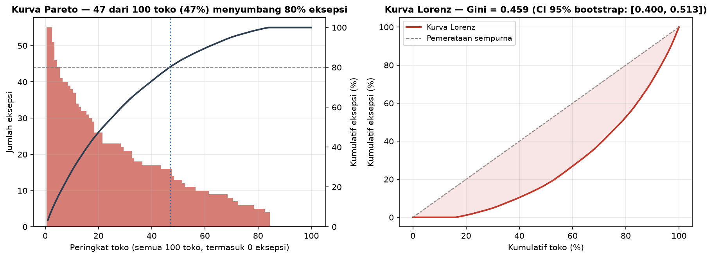

- **Rasio Pareto:** 47 dari 100 toko (47%) menghasilkan 80,3% dari seluruh
  eksepsi.
- **Koefisien Gini (armada penuh):** 0,459 dengan CI 95% bootstrap
  [0,400; 0,513] (10.000 resampel, seed 42). CI ini menyingkirkan pemerataan
  sempurna (0) maupun konsentrasi maksimal (1). Tidak ada p-value karena Gini
  adalah indeks deskriptif, bukan uji hipotesis.
- Jika toko nol-eksepsi dikeluarkan (kesalahan notebook V2), Gini turun
  menjadi 0,356 — meremehkan ketimpangan yang sebenarnya.
- Lima toko teratas: S-011 (55), S-037 (55), S-058 (51), S-092 (46),
  S-018 (44).

### Interpretasi bisnis

Konsentrasi ini moderat-tinggi: hampir separuh armada menyumbang empat
perlima beban eksepsi, sementara 16 toko beroperasi bersih. Risiko bersifat
struktural — intervensi tertarget, bukan kebijakan seragam, adalah tuas yang
tepat.

### Rekomendasi tindakan

Bentuk **watchlist "Fokus 47"** — 47 toko di atas ambang 80% mendapat kajian
diagnostik mingguan; 53 toko sisanya cukup kajian bulanan. Pelajari juga
praktik 16 toko nol-eksepsi sebagai pembanding (best practice internal).

**Transisi → Lapisan 2:** mengetahui *bahwa* risiko terkonsentrasi memberi
tahu kita *di mana* fokus. Pertanyaan berikutnya: *mengapa* — atribut toko
apa yang memprediksi volume eksepsi tinggi?

---

## Lapisan 2 — Analisis Segmentasi

### 2.1 Format toko

#### Observasi

Kelompok format dibangun di atas armada penuh 100 toko: standard (n=66),
drive-thru (n=16), flagship (n=9), kiosk (n=9).

#### Bukti statistik

**Uji asumsi (dijalankan SEBELUM ANOVA):**

| Pemeriksaan | Hasil | Status |
|---|---|---|
| Shapiro–Wilk (normalitas per grup) | drive-thru p=0,460 ✓; kiosk p=0,337 ✓; standard p=0,007 ✗; flagship p=0,009 ✗ | **GAGAL** |
| Levene (homogenitas ragam) | W=5,16, p=0,0024 | **GAGAL** |

Karena normalitas dan homogenitas ragam gagal, **Kruskal–Wallis adalah uji
otoritatif**; ANOVA dilaporkan sebagai pembanding.

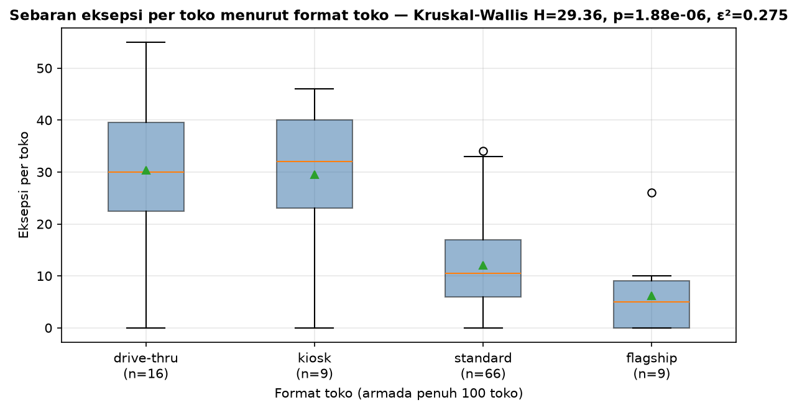

- **Kruskal–Wallis (otoritatif):** H=29,36, p=1,9×10⁻⁶, ε²=0,275 — efek
  besar (ε² adalah ukuran efek yang tepat untuk KW; η² milik ANOVA).
- ANOVA (pembanding): F(3,96)=19,48, p=6,0×10⁻¹⁰, η²=0,378. Uji
  Alexander–Govern (tahan ragam tak-sama): p=4,9×10⁻⁵. Ketiga uji sepakat.
- Rata-rata per format: drive-thru 30,4 · kiosk 29,6 · standard 12,0 ·
  flagship 6,2 eksepsi/toko.

**Post-hoc: Mann–Whitney U berpasangan dengan koreksi Holm** (konsisten
dengan jalur non-parametrik; ukuran efek rank-biserial r, plus Cohen's d
sebagai pembanding parametrik):

| Pasangan | p (mentah) | Signifikan (Holm) | Rank-biserial | Cohen's d |
|---|---|---|---|---|
| drive-thru vs standard | 3,5×10⁻⁵ | **Ya** | 0,67 | 1,74 (besar) |
| kiosk vs standard | 7,4×10⁻⁴ | **Ya** | 0,70 | 1,85 (besar) |
| drive-thru vs flagship | 2,5×10⁻³ | **Ya** | 0,74 | 1,68 (besar) |
| kiosk vs flagship | 7,4×10⁻³ | **Ya** | 0,75 | 1,92 (besar) |
| standard vs flagship | 0,032 | Tidak | 0,44 | 0,68 (sedang) |
| drive-thru vs kiosk | 0,977 | Tidak | −0,01 | 0,05 (dapat diabaikan) |

#### Interpretasi bisnis

Format toko adalah prediktor volume eksepsi yang paling kuat. Drive-thru dan
kiosk — format bertapak kecil dengan kecepatan transaksi tinggi — secara
struktural sekitar 2,5× lebih rawan eksepsi daripada standard dan hampir 5×
dibanding flagship. Keduanya tidak berbeda satu sama lain (p=0,98), jadi
keduanya layak diperlakukan sebagai satu kelas risiko. Ini **risiko
struktural tingkat format**, bukan kegagalan staf.

#### Rekomendasi tindakan

Sesuaikan kuantitas alokasi dan frekuensi audit untuk 25 toko drive-thru +
kiosk. Pertimbangkan ambang SLA khusus format yang memperhitungkan laju
eksepsi bawaan mereka.

### 2.2 Wilayah

#### Observasi

Apakah volume eksepsi total berbeda secara geografis? North 18,6 ·
West 16,7 · East 16,4 · South 12,6 eksepsi/toko.

#### Bukti statistik

Uji asumsi: Shapiro gagal untuk North (p=0,003) dan South (p=0,040); Levene
lolos (p=0,231). Kruskal–Wallis tetap menjadi uji otoritatif.

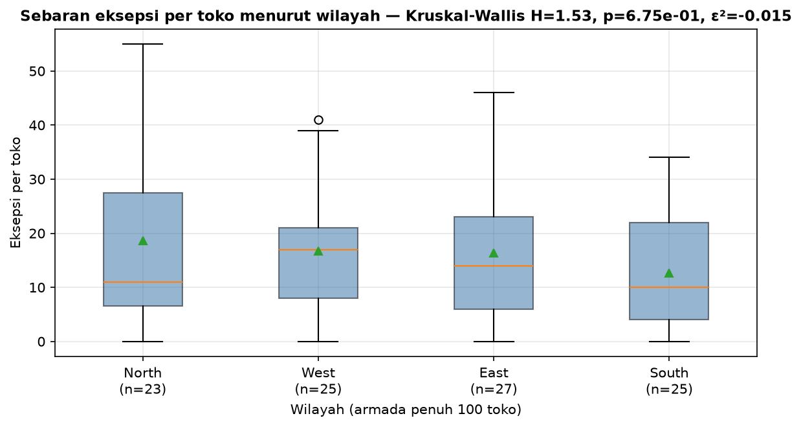

- **Kruskal–Wallis:** H=1,53, p=0,675, ε²≈0 (−0,015; nilai negatif kecil
  berarti efek praktis nol).
- ANOVA (pembanding): F(3,96)=0,82, p=0,484, η²=0,025.
- Post-hoc Mann–Whitney + Holm: 0 dari 6 pasangan signifikan (efek terbesar
  North vs South, d=0,40 — kecil).
- **Catatan daya uji:** untuk efek sedang konvensional (Cohen's f=0,25),
  daya desain ini hanya 0,52 — di bawah standar 0,80. Hasil non-signifikan
  ini **berpotensi kurang daya** dan tidak boleh dibaca sebagai bukti bahwa
  semua wilayah identik; yang bisa dikatakan adalah tidak ada perbedaan
  besar yang terlihat.

#### Interpretasi bisnis

Untuk total volume, format jauh lebih penting daripada geografi. Namun
wilayah dengan volume total rata-rata masih bisa kelebihan indeks pada mode
kegagalan spesifik — pertanyaan itu dijawab Lapisan 3.

#### Rekomendasi tindakan

Jangan mengalokasikan sumber daya berbasis "wilayah bermasalah" secara
umum; gunakan sinyal per-tipe dari Lapisan 3.

**Transisi → Lapisan 3:** Lapisan 1–2 menjawab "di mana" dan "jenis toko
apa". Lapisan 3 menanyakan *siapa* dan *mengapa*: hotspot wilayah per tipe,
field rep, dan mitra hulu (DC/kurir).

---

## Lapisan 3 — Analisis Atribusi

### 3.1 Hotspot regional per tipe eksepsi

#### Observasi

Insight engine heuristik menandai 6 kombinasi wilayah×tipe. Kami menguji
ulang **seluruh keluarga penyaringan** — 32 sel wilayah×tipe dengan
ekspektasi ≥5 — langsung dari kolom terstruktur `exception_type` dan
`region` (bukan dari parsing teks headline, sumber bug fatal di notebook V2).

#### Bukti statistik

Setiap sel diuji dengan **uji binomial eksak dua arah** (observasi vs pangsa
toko wilayah sebagai baseline) dan dikoreksi **BH-FDR di seluruh 32 sel**.
CI lift diturunkan dari CI Wilson pada proporsi.

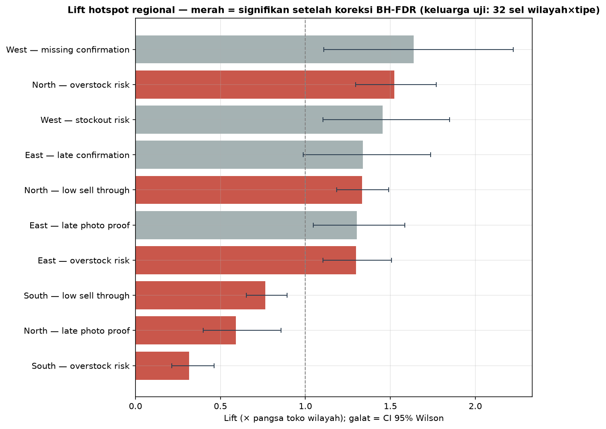

**6 sel signifikan setelah BH-FDR (q<0,05):**

| Wilayah | Tipe eksepsi | Obs. | Eksp. | Lift [CI 95%] | p-FDR |
|---|---|---|---|---|---|
| South | overstock_risk | 23 | 72,8 | 0,32× [0,21; 0,46] | 2,8×10⁻¹² |
| North | overstock_risk | 102 | 66,9 | 1,52× [1,30; 1,77] | 5,7×10⁻⁵ |
| North | low_sell_through | 202 | 151,6 | 1,33× [1,18; 1,49] | 7,1×10⁻⁵ |
| South | low_sell_through | 126 | 164,8 | 0,76× [0,65; 0,89] | 0,0030 |
| East | overstock_risk | 102 | 78,6 | 1,30× [1,10; 1,51] | 0,018 |
| North | late_photo_proof | 22 | 37,3 | 0,59× [0,40; 0,86] | 0,019 |

**Sel yang ditandai engine tetapi TIDAK lolos FDR:** West–stockout_risk
(1,45×, p-FDR=0,065), East–late_photo_proof (1,30×, p-FDR=0,079),
West–missing_confirmation (1,64×, p-FDR=0,079), East–late_confirmation
(1,34×, p-FDR=0,158). Ini tetap hipotesis, bukan temuan.

#### Interpretasi bisnis

Pola yang lolos uji sangat koheren: **North kelebihan indeks pada overstock
DAN low sell-through sekaligus** — kombinasi klasik masalah perencanaan
assortment/alokasi (barang terlalu banyak dikirim relatif terhadap
permintaan lokal), bukan masalah eksekusi lapangan (North justru KEKURANGAN
indeks pada late photo proof, 0,59×). Cerminan sebaliknya di South
(overstock 0,32×, low sell-through 0,76×) memperkuat interpretasi ini:
kalibrasi alokasi antar wilayah tidak seimbang.

#### Rekomendasi tindakan

Audit assortment dan model alokasi untuk wilayah North (304 eksepsi pada dua
tipe signifikan); gunakan profil permintaan South sebagai pembanding
kalibrasi. Tunda tindakan untuk 4 sel yang tidak lolos FDR sampai ada data
tambahan.

### 3.2 Field rep — kegagalan kepatuhan (konfirmasi & bukti foto)

#### Observasi

400 eksepsi kepatuhan (missing/late confirmation, missing/late photo proof).
46 di antaranya terjadi di 13 toko **tanpa field rep yang ditugaskan** —
dikeluarkan dari analisis per-rep dan dilaporkan terbuka (celah cakupan
tersendiri yang layak ditindak). Laju armada: 4,07 eksepsi
kepatuhan/toko (87 toko tercakup, 16 rep).

#### Bukti statistik

Jumlah per-toko sangat **overdispersed** relatif terhadap Poisson
(varians/rata-rata = 3,6), sehingga uji Poisson eksak — yang dipakai
notebook V2 — anti-konservatif dan tidak sah. Sebagai gantinya kami memakai
**uji permutasi tingkat toko** (20.000 permutasi; label rep ditukar antar
toko, menghormati klasterisasi), satu arah untuk kelebihan indeks, dikoreksi
BH-FDR di 16 rep. CI lift dari bootstrap tingkat toko (5.000 resampel).

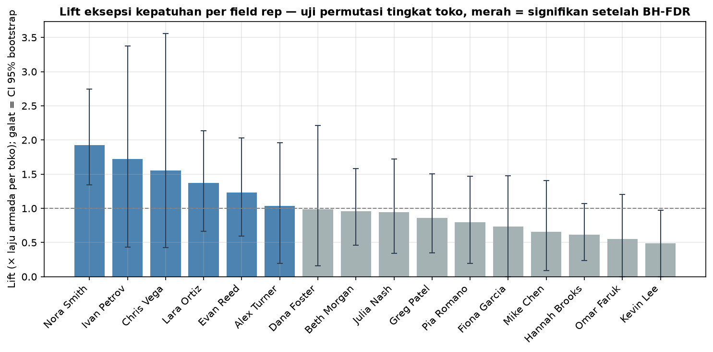

- **Tidak ada satu pun rep yang signifikan setelah BH-FDR.**
- Lift tertinggi: Nora Smith — 47 eksepsi / 6 toko = 7,8/toko, lift 1,93×
  [CI 95%: 1,34; 2,74], p mentah=0,012, **p-FDR=0,19**.
- Ivan Petrov (1,72×), Chris Vega (1,56×), Lara Ortiz (1,37×): p mentah
  0,16–0,17, jauh dari signifikan.

#### Interpretasi bisnis

Ini koreksi penting atas narasi V2 (yang mengklaim Nora Smith signifikan
dengan p-FDR=0,0005 berdasarkan uji Poisson yang asumsinya dilanggar).
Setelah klasterisasi toko diperhitungkan, sinyal per-rep **tidak dapat
dibedakan dari variasi antar-toko biasa**: toko-toko Nora Smith mungkin
memang lebih sulit, bukan repnya yang berkinerja buruk. Data ini tidak
mendukung tindakan personalia terhadap rep mana pun.

#### Rekomendasi tindakan

Jangan lakukan review teritori berbasis "rep bermasalah". Dua tindakan yang
didukung data: (1) tugaskan field rep untuk 13 toko tanpa cakupan (46
eksepsi kepatuhan tanpa pemilik); (2) pantau Nora Smith secara deskriptif
selama 4 minggu — jika liftnya menetap dengan data baru, uji ulang.

### 3.3 Atribusi hulu — DC dan kurir

#### Observasi

148 eksepsi quantity mismatch, semuanya berhasil dipetakan ke catatan
dispatch (DC dan kurir).

#### Bukti statistik

Chi-square goodness-of-fit terhadap ekspektasi proporsional volume kiriman.
Asumsi terpenuhi: seluruh ekspektasi sel ≥46 (jauh di atas ambang 5).

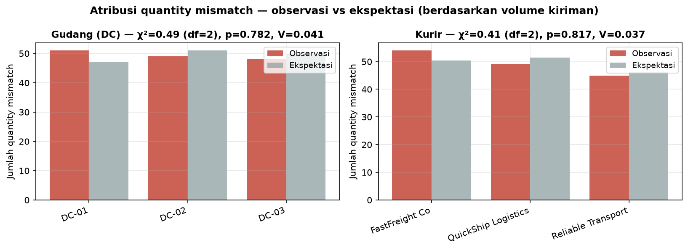

- **DC:** χ²=0,49 (df=2), p=0,782, Cramér's V=0,041 (dapat diabaikan).
- **Kurir:** χ²=0,41 (df=2), p=0,817, Cramér's V=0,037 (dapat diabaikan).

#### Interpretasi bisnis

Mismatch tersebar hampir persis proporsional dengan volume kiriman — tidak
ada satu mitra hulu pun yang menjadi biang. Masalahnya kemungkinan besar
**sistemik**: celah rekonsiliasi data antara sistem alokasi dan dispatch.
Catatan: dengan n=148, uji ini hanya berdaya untuk penyimpangan besar; namun
ketiadaan sinyal sekecil apa pun (V<0,05) konsisten dengan penyebab sistemik.

#### Rekomendasi tindakan

Alihkan intervensi dari manajemen vendor ke **audit rekonsiliasi data
alokasi-vs-dispatch-vs-penerimaan** (35% mismatch juga melanggar SLA — lihat
Lapisan 4).

**Transisi → Lapisan 4:** Lapisan 1–3 mendiagnosis di mana dan mengapa
risiko terkonsentrasi. Lapisan 4 beralih dari diagnosis ke tindakan: apa
yang bisa dilakukan operasi *sekarang*?

---

## Lapisan 4 — Analisis Peluang

### 4.1 Rebalancing inventori: kemenangan tanpa biaya pengadaan

#### Observasi

Beberapa SKU secara simultan ditandai risiko stockout di sebagian toko dan
risiko overstock di toko lain — dalam kampanye yang sama.

#### Bukti statistik

Tidak ada uji inferensial di sini: analisis gap rebalancing beroperasi pada
sensus penuh (semua SKU dan toko dalam kampanye aktif), sehingga angkanya
adalah fakta hitung, bukan estimasi sampel.

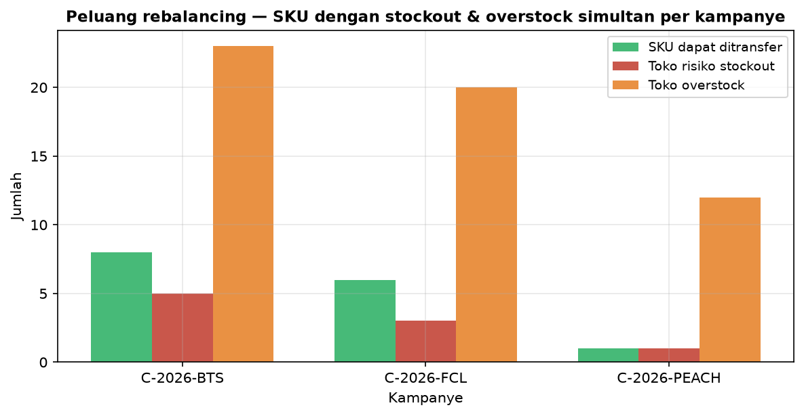

| Kampanye | SKU dapat ditransfer | Toko stockout | Toko overstock |
|---|---|---|---|
| C-2026-BTS | 8 | 5 | 23 |
| C-2026-FCL | 6 | 3 | 20 |
| C-2026-PEACH | 1 | 1 | 12 |
| **Total** | **15** | **9** | **55** |

64 titik-sentuh toko-kampanye secara total.

#### Interpretasi bisnis

Memindahkan stok dari toko overstock ke toko yang hampir kehabisan dalam
kampanye yang sama tidak memerlukan pesanan pembelian baru, negosiasi
vendor, ataupun markdown — hanya biaya logistik transfer antar-toko.

#### Rekomendasi tindakan

Terbitkan draf transfer order untuk 15 SKU; prioritas kampanye BTS (8 SKU),
lalu FCL (6), lalu PEACH (1). Validasi waktu tempuh sebelum jendela kampanye
berakhir.

### 4.2 Profil risiko SLA dan umur eksepsi

#### Observasi

160 dari 1.603 eksepsi (10,0%, CI 95% Wilson [8,6%; 11,5%]) telah melanggar
SLA; 8 lagi mendekati batas. Porsi eksepsi kritis 40,6% (CI Wilson
[38,2%; 43,0%]).

#### Bukti statistik

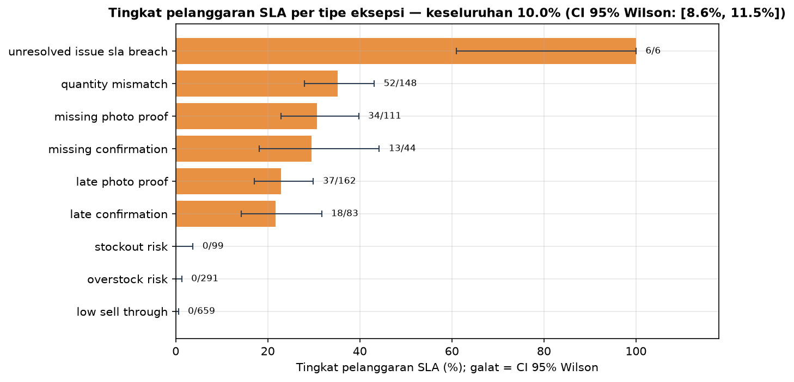

Tipe dengan tingkat pelanggaran tertinggi: unresolved_issue_sla_breach 6/6
(100% — by definition), quantity_mismatch 52/148 (35%), missing_photo_proof
34/111 (31%), missing_confirmation 13/44 (30%). Tipe risiko inventori
(stockout/overstock/low sell-through) belum melanggar (0%) karena jendela
SLA-nya lebih panjang (24–168 jam) dan sebagian besar baru terdeteksi.
Ini profil risiko deskriptif — tidak ada chi-square antar-tipe karena
tipe-tipe memiliki jendela SLA berbeda by design.

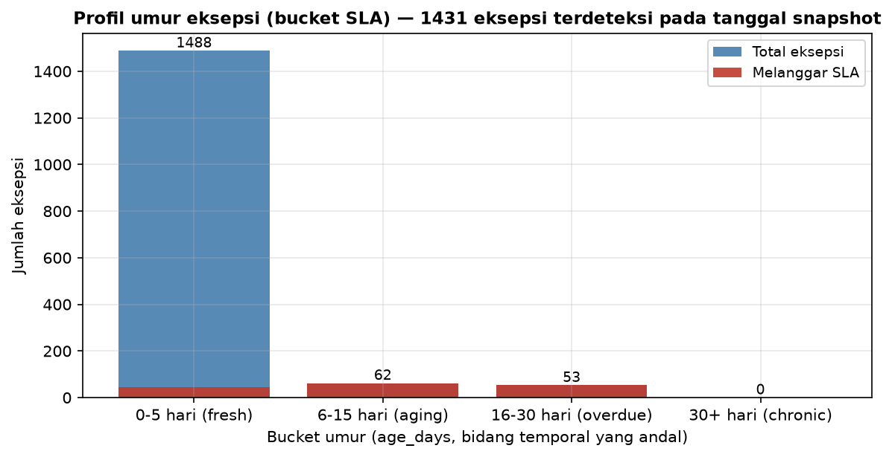

Profil umur (dari `age_days`, bidang temporal yang andal): 1.488 fresh
(0–5 hari; 45 melanggar), 62 aging (6–15 hari; semuanya melanggar),
53 overdue (16–30 hari; semuanya melanggar), 0 chronic.

> **Mengapa tidak ada analisis tren harian?** Kolom `created_date` di tabel
> eksepsi cacat: 1.423 dari 1.603 nilai bertanggal SETELAH tanggal snapshot
> dan bertentangan dengan `age_days`. Analisis tren temporal di notebook V2
> dibangun di atas kolom cacat ini (bahkan "hari puncaknya" berada di luar
> rentang tanggal yang diklaimnya sendiri). Karena 1.431 eksepsi (89%)
> terdeteksi tepat pada tanggal snapshot, tidak ada deret waktu harian yang
> valid — profil umur di atas adalah representasi temporal yang jujur.

#### Interpretasi bisnis

Setiap eksepsi yang melewati usia 5 hari praktis pasti melanggar SLA
(115/115 pada bucket 6+ hari). Antrian eskalasi harus menyerang eksepsi
sebelum keluar dari bucket fresh.

#### Rekomendasi tindakan

Prioritaskan 8 eksepsi berstatus "approaching", lalu 45 pelanggaran di
bucket fresh (masih baru — peluang pemulihan terbaik). Jadikan
quantity_mismatch fokus ganda: tingkat pelanggaran tertinggi di antara tipe
bervolume besar DAN penyebabnya sistemik (§3.3).

### 4.3 Estimasi dampak finansial (ilustratif)

> **Peringatan — semua nilai dolar ilustratif.** Parameter biaya adalah
> placeholder untuk angka riil dari tim finance. Struktur perhitungannya —
> bukan nominalnya — yang menjadi deliverable. Tidak ada uji inferensial:
> ketidakpastiannya parametrik (konstanta biaya), bukan statistik.

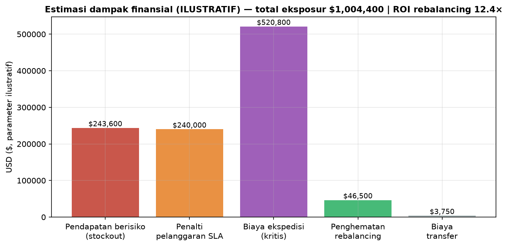

| Pos | Pendorong (dari data) | Parameter | Total |
|---|---|---|---|
| Pendapatan berisiko stockout | 58 toko dengan eksepsi `stockout_risk` | $4.200/toko-hari | $243.600 |
| Penalti pelanggaran SLA | 160 pelanggaran | $1.500/pelanggaran | $240.000 |
| Biaya ekspedisi kritis | 651 eksepsi kritis | $800/eksepsi | $520.800 |
| **Total eksposur** | | | **$1.004.400** |
| Penghematan rebalancing | 15 aksi transfer (=15 SKU §4.1) | $3.100/aksi | $46.500 |
| Biaya transfer | 15 aksi | $250/aksi | ($3.750) |
| **Nilai bersih rebalancing** | | | **$42.750 (ROI 12,4×)** |

Rebalancing membayar dirinya sendiri 12,4 kali lipat — tindakan finansial
dengan tuas tertinggi dalam analisis ini, dan rasionya (bukan nominalnya)
tetap stabil selama parameter biaya bergeser proporsional.

### 4.4 Sensitivitas peringkat impact score

#### Observasi

Skor dampak insight engine adalah
`affected_count × min(lift, 3,0) + critical_count × 2`. Seberapa rapuh
urutan prioritas terhadap pilihan bobotnya?

#### Bukti statistik

Jumlah eksepsi kritis per insight dihitung ulang **langsung dari tabel
eksepsi** (bukan direkayasa-balik dari rumus skor), dan rekonstruksi
memreproduksi ke-14 skor terbit dengan tepat (verifikasi otomatis: lolos).
Tiga skenario bobot diuji; kesesuaian peringkat diukur dengan Spearman ρ.

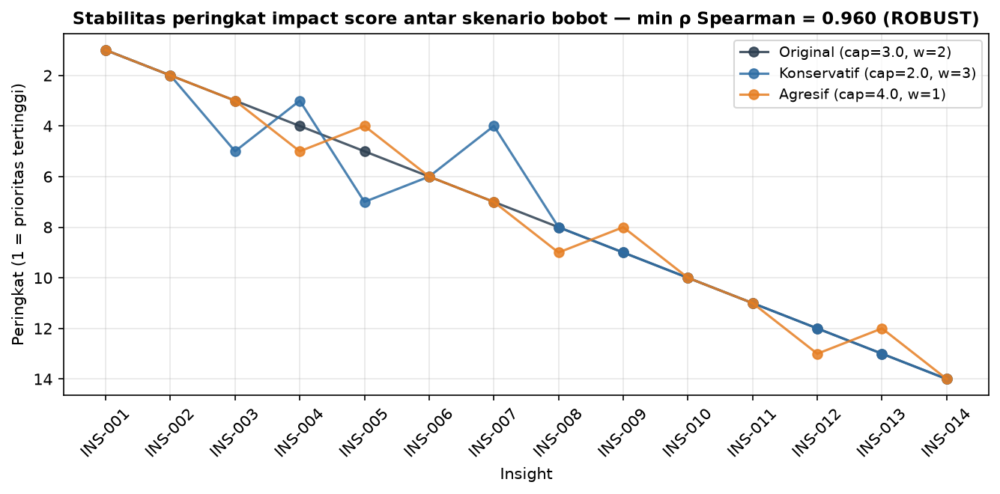

- Original vs Konservatif (cap lift 2,0; bobot kritis 3): ρ=0,960
  (p=5,1×10⁻⁸).
- Original vs Agresif (cap lift 4,0; bobot kritis 1): ρ=0,987
  (p=7,4×10⁻¹¹).
- **Vonis: ROBUST** (min ρ=0,960 ≥ 0,8). INS-001 s.d. INS-004 berada di
  top-5 pada ketiga skenario.

#### Interpretasi bisnis

Antrian tindakan tidak akan terkocok ulang oleh perdebatan bobot antara
finance dan operasi — urutannya ditentukan data, bukan pilihan parameter.
Catatan: sensitivitas mengukur *kestabilan* peringkat, bukan *kebenaran*
bobot; kalibrasi bobot yang benar dijawab dengan melacak realisasi
penghematan dari insight yang diprioritaskan.

---

## Sintesis — Kerangka Tindakan Terprioritas

| # | Tindakan | Lapisan | Bukti | Dampak | Waktu ke nilai |
|---|---|---|---|---|---|
| 1 | Bentuk watchlist "Fokus 47" | Konsentrasi | Pareto 47/100 toko = 80,3%; Gini 0,459 [0,400; 0,513] | 80% beban eksepsi | 1 minggu |
| 2 | Transfer antar-toko 15 SKU | Peluang | Gap rebalancing sensus; ROI ilustratif 12,4× | 64 titik-sentuh toko-kampanye | Segera |
| 3 | Audit assortment & alokasi wilayah North | Atribusi | Overstock 1,52× + low sell-through 1,33×, keduanya p-FDR<10⁻⁴ | 304 eksepsi | 2 minggu |
| 4 | Kebijakan alokasi & SLA khusus format drive-thru/kiosk | Segmentasi | KW p=1,9×10⁻⁶, ε²=0,275; 4/6 pasangan signifikan (Holm), d=1,7–1,9 | 25 toko | 4 minggu |
| 5 | Audit rekonsiliasi data alokasi-vs-dispatch | Atribusi | χ² p=0,782/0,817, V≤0,041 → sistemik; 35% mismatch melanggar SLA | 148 mismatch | 4–6 minggu |
| 6 | Tugaskan field rep untuk 13 toko tanpa cakupan | Atribusi | 46 eksepsi kepatuhan tanpa pemilik | 13 toko | 2 minggu |

Tindakan yang secara sadar **TIDAK** direkomendasikan: review teritori
per-rep (tidak ada rep yang signifikan setelah uji yang sahih, §3.2) dan
intervensi "wilayah bermasalah" berbasis volume total (§2.2).

---

## Lampiran A — Koreksi terhadap Notebook V2

Versi ini menggantikan `notebooks/insight_engine_story_v2.ipynb`. Kesalahan
yang ditemukan dan diperbaiki:

| # | Kesalahan V2 | Perbaikan | Dampak pada angka |
|---|---|---|---|
| 1 | Toko nol-eksepsi (16 toko) dikeluarkan dari semua statistik armada | Semua analisis memakai armada penuh 100 toko | Gini 0,356→0,459; Pareto "47/84 (56%)"→"47/100 (47%)"; semua rerata & n grup segmentasi berubah (V2 bahkan mengutip n grup yang mustahil: 22 drive-thru padahal hanya ada 16) |
| 2 | Chi-square hotspot regional degeneratif: tipe eksepsi diparsing dari teks headline ("low sell through") lalu dicocokkan ke kolom bergaris-bawah ("low_sell_through") → semua observasi = 0, p=NaN, CI [0,00; 0,00] | Uji binomial eksak langsung dari kolom terstruktur; keluarga FDR diperluas ke seluruh 32 sel yang disaring | 6 sel kini benar-benar signifikan (termasuk pola under-index South yang tak terlihat di V2); 4 dari 6 sel yang ditandai engine ternyata TIDAK lolos FDR |
| 3 | Analisis tren temporal dibangun di atas `created_date` yang cacat (1.423/1.603 nilai bertanggal setelah snapshot, kontradiktif dengan `age_days`); klaim V2 kontradiktif secara internal (hari puncak 2026-08-28 di luar rentang klaimnya sendiri 2026-05-01–2026-08-08) | Regresi tren harian dihapus sebagai tidak valid; diganti profil umur berbasis `age_days` | Tidak ada lagi klaim tren; 89% eksepsi terdeteksi pada tanggal snapshot |
| 4 | Uji Poisson field rep melanggar asumsi (overdispersi var/mean=3,6 di tingkat toko), CI "eksak" dihitung dengan `poisson.ppf(q, observed)` yang bukan CI eksak, dan 46 eksepsi di toko tanpa rep dibuang diam-diam | Uji permutasi tingkat toko + bootstrap CI + BH-FDR; eksklusi dilaporkan terbuka | Klaim "Nora Smith signifikan (p-FDR=0,0005)" runtuh → p-FDR=0,19; tidak ada rep yang dapat ditandai |
| 5 | Model finansial menghitung "stockout-class" dengan tipe yang tidak ada di taksonomi (`out_of_stock`, `damaged_shipment`); ROI dihitung atas 3 baris insight padahal rekomendasinya 15 SKU | Pendorong diperbaiki ke `stockout_risk` (58 toko); aksi transfer = 15 SKU-kampanye | Eksposur $1.038.000→$1.004.400; penghematan $9.300→$46.500; ROI tetap 12,4× |
| 6 | Post-hoc t-test ragam-gabungan meski Levene gagal; η² dilekatkan ke Kruskal–Wallis; CI Wilson dikutip di narasi tanpa pernah dihitung di kode; critical_count direkayasa-balik dari rumus skor (rentan galat pembulatan) | Mann–Whitney+Holm+rank-biserial; ε² untuk KW; CI Wilson dihitung sungguhan; critical_count dihitung dari data mentah dan diverifikasi memreproduksi skor terbit | Kesimpulan post-hoc format bertahan; angka daya uji V2 (berbasis n grup fiktif) dibuang |

## Lampiran B — Reproduksibilitas

- **Menjalankan semua analisis:** `python -m scripts.insight_engine.run_all`
  (atau `from scripts.insight_engine import run_all; run_all()`),
  atau per lapisan: `python -m scripts.insight_engine.layer1_concentration`, dst.
- **Keluaran:** grafik PNG di `images/`, ekspor terstruktur (JSON + CSV) di
  `data/insight_exports/`.
- **Determinisme:** seed PRNG 42; bootstrap Gini 10.000 iterasi; permutasi
  field rep 20.000 iterasi; bootstrap lift rep 5.000 iterasi.
- **Konvensi statistik:** uji asumsi sebelum setiap uji parametrik; ukuran
  efek menyertai setiap p-value (ε², η², rank-biserial, Cohen's d, Cramér's
  V, lift); koreksi perbandingan berganda pada setiap keluarga uji (Holm
  untuk post-hoc terstruktur, BH-FDR untuk penyaringan eksploratif); CI
  Wilson untuk proporsi; CI bootstrap persentil untuk statistik deskriptif.

---

*Retail Ops Control Tower — Insight Engine | snapshot 2026-07-15*
